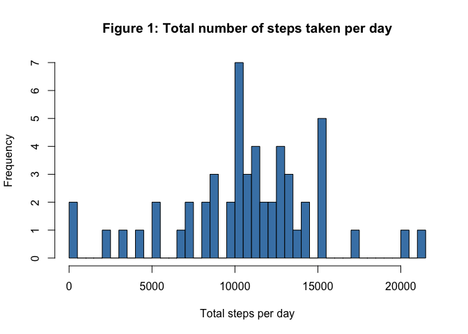
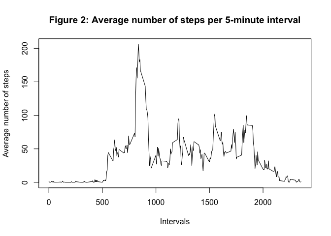
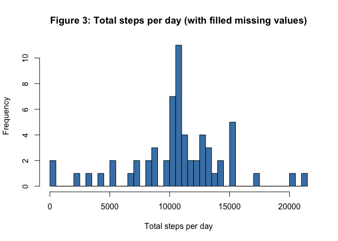
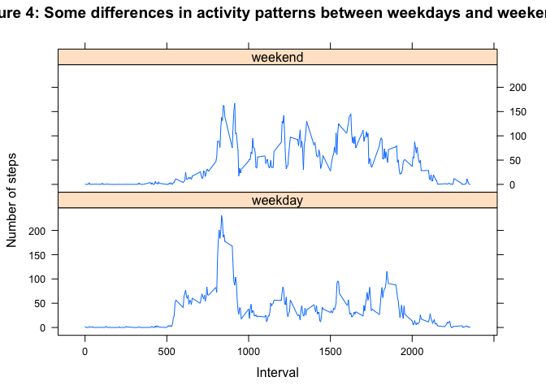

# Reproducible Research: Peer Assessment 1


## Loading and preprocessing the data
We are going to use `dplyr` package here. 
Please install it with `install(dplyr)` if neccessary.

```r
library(dplyr)
```

```
## 
## Attaching package: 'dplyr'
## 
## The following object is masked from 'package:stats':
## 
##     filter
## 
## The following objects are masked from 'package:base':
## 
##     intersect, setdiff, setequal, union
```


Let's load data from this url.

```r
url <- 'https://d396qusza40orc.cloudfront.net/repdata%2Fdata%2Factivity.zip'
# osx specific: method = 'curl'
download.file(url = url, destfile = 'repdata-data-activity.zip', method = 'curl')
unzip('repdata-data-activity.zip')

# Assume we know the file name
activities <- tbl_df(read.csv('activity.csv'))
```


## What is mean total number of steps taken per day?
For this part of the assignment, we'll ignore the missing values in the dataset.

```r
activityByDate <- activities %>% 
    na.omit %>%
    group_by(date)
```

1. Let's calculate the total number of steps taken per day

```r
sumByDate <- activityByDate %>%
    summarise(sum(steps))
colnames(sumByDate) <- c('date','steps')
```

2. Let's see a histogram of the total number of steps taken each day

```r
hist(sumByDate$steps, 
     main = 'Figure 1: Total number of steps taken per day',
     xlab = 'Total steps per day',
     breaks = length(sumByDate$steps),
     col = 'steelblue')    
```

 

3. Let's see the mean and median total number of steps taken per day

```r
meanSum <- mean(sumByDate$steps)
medianSum <- median(sumByDate$steps)
```

Now one can say that the _mean_ of total number of steps taken per day 
is 10766.19 cand it's _median_ is 10765.


## What is the average daily activity pattern?

1. Let's make a time series plot (i.e. type = "l") of the 5-minute interval (x-axis) and the average number of steps taken, averaged across all days (y-axis)

```r
stepsByInterval <- activities %>%
    na.omit %>%
    group_by(interval) %>%
    summarise(mean(steps))

stepsByInterval %>%
    plot(type = 'l',
         main = 'Figure 2: Average number of steps per 5-minute interval',
         xlab = 'Intervals',
         ylab = 'Average number of steps')
```

 

2. Which 5-minute interval, on average across all the days in the dataset, contains the maximum number of steps?

```r
colnames(stepsByInterval) <- c('interval', 'steps')
maxInterval <- stepsByInterval$interval[which.max(stepsByInterval$steps)]
maxSteps <- max(stepsByInterval$steps)
```
Average maximum of steps (which is 206.1698113) is contained 
in the interval 830:835.

## Imputing missing values

Note that there are a number of days/intervals where there are missing values (coded as NA). The presence of missing days may introduce bias into some calculations or summaries of the data.

1. Let's calculate the total number of missing values in the dataset (i.e. the total number of rows with NAs)

There are 2304 cases with missing values in the dataset. And there are 2304 NA values for `steps` variable.
So all missing values are in the `steps` column.

2. Devise a strategy for filling in all of the missing values in the dataset. The strategy does not need to be sophisticated. For example, you could use the mean/median for that day, or the mean for that 5-minute interval, etc.
Let's use a trick to test the nature of missin values. We'll measure how observations with missing steps are distributed along dates/days.

```r
naActivities <- filter(activities, !complete.cases(activities))
naActivities$count <- 1
numOfMissingPerDate <- naActivities %>% group_by(date) %>% summarise(sum(count))
numOfUniqueIntervals <- length(stepsByInterval$interval)
```

Let's note that `all(numOfUniqueIntervals == numOfMissingPerDate[[2]])` is TRUE.
So  (assuming date+interval is a key -- an unique pair -- for an observation) missing steps for an observation in a day means that that day is totally missed.
Knowing that we can fill missing values with average steps for that interval

The strategy to fill with zero value is also OK.

3. Create a new dataset that is equal to the original dataset but with the missing data filled in.

```r
#activities[is.na(activities$steps),]$steps <- 0
activities[is.na(activities$steps),]$steps <- stepsByInterval$steps
```
NB There is no need to repeat this vector. It will be repeated automatically

4. Make a histogram of the total number of steps taken each day and Calculate and report the mean and median total number of steps taken per day. Do these values differ from the estimates from the first part of the assignment? What is the impact of imputing missing data on the estimates of the total daily number of steps?

```r
withNoNA <- activities %>%
    group_by(date) %>%
    summarise(sum(steps))
colnames(withNoNA) <- c('date','steps')
withNoNA$steps %>% 
    hist(
        main = 'Figure 3: Total steps per day (with filled missing values)',
        xlab = 'Total steps per day',
        breaks = length(withNoNA$steps),
        col = 'steelblue')    
```

 

```r
meanSumNoNA <- mean(withNoNA$steps)
medianSumNoNA <- median(withNoNA$steps)
```

Now one can say that the _mean_ of total number of steps taken per day is 10766.19 
and it's _median_ is 10766.19.

The _mean_ stayed the same, the _median_ became equal to _mean_ (there are more values close to mean value now)

## Are there differences in activity patterns between weekdays and weekends?

Need this to work with english week day names

```r
Sys.setlocale(category = "LC_ALL", locale = "C")
```

```
## [1] "C/C/C/C/C/ru_RU.UTF-8"
```


1. Let's add a column with a day type to our dataset -- a new factor variable in the dataset with two levels <U+2013> <U+201C>weekday<U+201D> and <U+201C>weekend<U+201D> indicating whether a given date is a weekday or weekend day.

```r
weekDayName <- weekdays(strptime(activities$date, "%Y-%m-%d"), abbreviate=T)

activitiesWeekInfo <- activities %>%
    mutate(dayType = ifelse(weekDayName %in% c('Sat', 'Sun'), 'weekend', 'weekday')) %>%
    group_by(dayType, interval) %>%
    summarise(avgSteps = mean(steps))
```

2. Let's make a panel plot containing a time series plot (i.e. type = "l") of the 5-minute interval (x-axis) and the average number of steps taken, averaged across all weekday days or weekend days (y-axis). We'll use `lattice` package for it.

```r
require(lattice)
```

```
## Loading required package: lattice
```

```r
xyplot(avgSteps ~ interval|dayType,
       data = activitiesWeekInfo,
       type = 'l',
       layout = c(1,2),
       main = 'Figure 4: Some differences in activity patterns between weekdays and weekends',
       xlab='Interval',
       ylab = "Number of steps")
```

 

